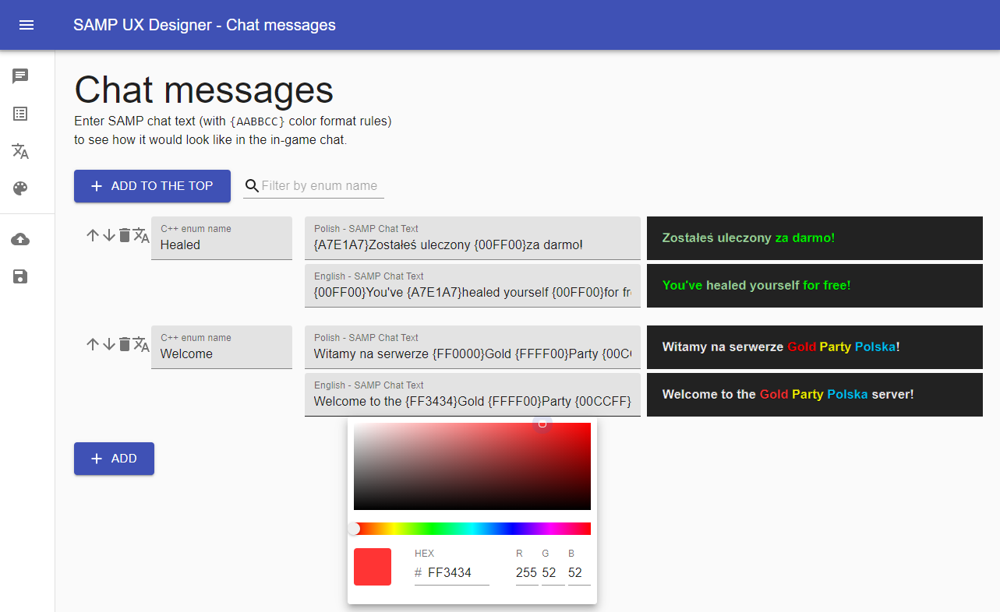
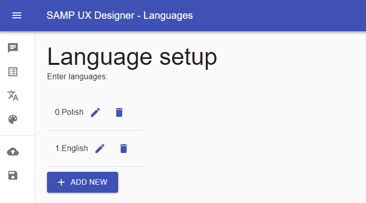
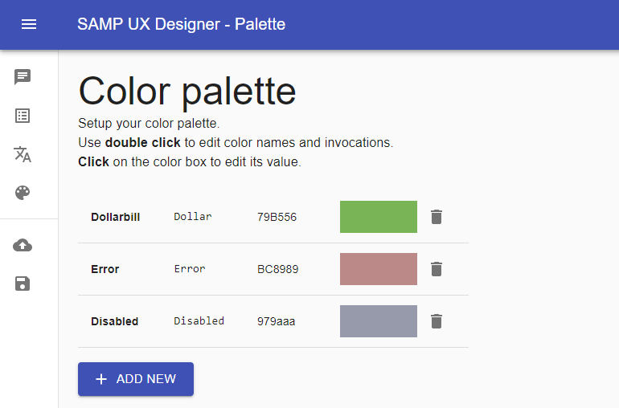

# SAMP UX Designer

An online designer tool for the San Andreas Multiplayer.

## 🚀 Quick start

To play with this tool visit following website:

[https://sampux.netlify.app](https://sampux.netlify.app)

## Features

### Chat messages

- Add, edit and preview chat messages.
- Enable and edit translated versions by clicking
the **translate button** on the left.
- Double click on the insides of a _color breakpoint_ (`{` **`AABBCC`** `}`) to enable **Color Picker Tool**.
- Use predefined named colors from the color palette with: `{$ColorInvocation}`, for example: `{$Dollar}`.

### Localization setup

- Add or edit supported languages
- When you edit the name of a language it will update the
messages that use this language.

### Palette of predefined colors

Each predefined color consists of:
- a pretty name - used only for the designer
- a **invocation** - a short name that you use within chat messages
- a value - HEX value of the color

To use predefined named colors write: `{$ColorInvocation}` inside a SAMP Chat Text, for example: `You bought a Desert Eagle for {$Dollar}$500`.

### Planned features

- [ ] dialog prototyping
- [ ] chat message categories
- [ ] improved UI

## Contributing

Contributions are welcome! Please make a pull request.

## Author

Paweł Syska (a.k.a. CrossX / Soldier)
